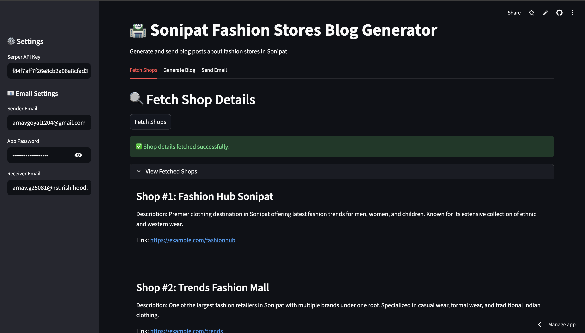
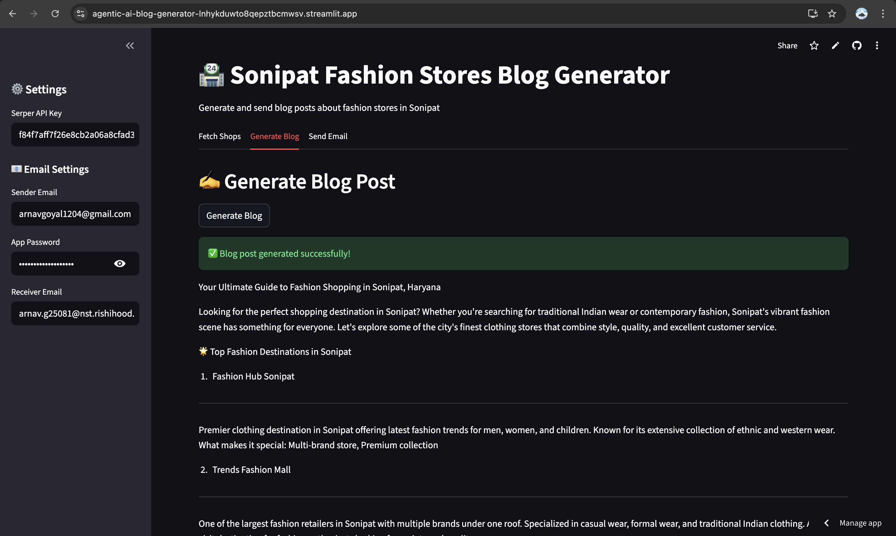
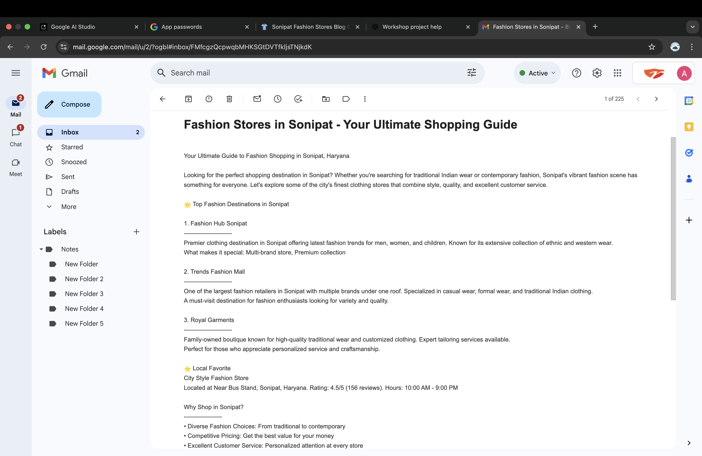

# 🧠 Agentic AI Blog Generator

This project was built at Rishihood University's **Agentic AI for Societal Good Workshop (27 Sept 2025)**.

## 🔍 What it does
This tool helps users:
- Search for **clothing stores in Sonipat** using the Serper API (Google search wrapper)
- Generate a **fashion blog post** using an LLM (Google Gemini)
- Automatically send the blog as a **HTML-styled email**

## 💡 Tech Used
- Python
- Streamlit
- Google Gemini (via `google-generativeai`)
- Serper API
- Gmail SMTP (App Password)
- GitHub Copilot

## 📷 Demo

## 📬 How to Use
1. Paste your Serper API Key and click **Generate Blog**
2. Click **Send Email** to send it to your inbox

## 🧑‍💻 Author
**Arnav Goyal**  
BTech CSE (AI) – Rishihood University  
[LinkedIn](https://www.linkedin.com/in/arnav-goyal-194056364/) | [GitHub](https://github.com/beginner-1204)  
Built during the "Agentic AI for Societal Good" workshop.
